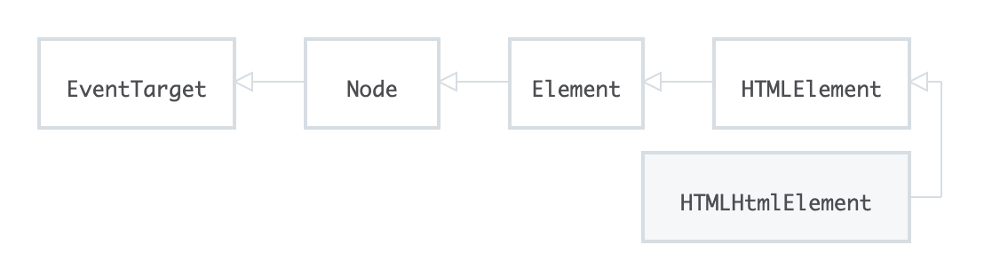

Node是一个接口，包含属性和方法, 下图是几个接口间的继承链

https://developer.mozilla.org/zh-CN/docs/Web/API/Document

card.innerHTML(Element): 可以设置或返回 所选元素_内部所有子节点和后代_（即标签之间）的 HTML 内容。如果你想更新一个元素，_包括_它的 HTML，则需要使用 .innerHTML 属性

card.textContent(Node): 返回或设置一个元素内所有子结点及其后代的文本内容。将任何看起来像是 HTML 的文本传递给 .textContent 属性，结果仍将显示为文本。当元素被渲染时，它_不会_被显示为 HTML。

card.innerText(HTMLElement): 获得渲染后的文本内容, 它能感知CSS样式。 也可以设置内容。

document.createElement: 其实并不会在页面上的任何位置添加新创建的元素！创建一个元素...就只是创建而已，并不会将其添加到 DOM
document.createTextNode: 创建新的_文本_ 节点。元素的 .textContent 属性比使用 .createTextNode() 方法创建文本节点更经常被用到

appendChild(Node): 末尾添加元素, 不能直接传字符串，必须用createTextNode创建出Text
append(Element): 末尾添加元素，可以传多个，也可以直接传字符串
insertAdjacentHTML(Element): 将指定的文本解析为HTML或XML，并将结果节点插入到DOM树中的指定位置. 可以是父元素的内部，也可以是父元素的前面后后面位置(即与父元素并列)
insertAdjacentElement(Element): 参数是元素节点，而非文本

\<parent-element>.removeChild(\<child-to-remove>): 在将要移除的元素的父元素上调用，并且必须传递将要移除的子元素
.remove(): 自己删除自己, 直接在将要删除的元素上调用。
.firstChild: 则_可能_返回Text（如果有的话: 比如空或字符串）以保留底层 HTML 源代码的格式。
.firstElementChild: 总是返回第一个元素
.parentElement:

设置页面样式：

.style.\<prop>: 改变元素的_单个_ 样式
.cssText(): 一次设置多个 CSS 样式
.setAttribute(): 设置任何属性, 不只是style
.className: 是个字符串，可以被重设
.classList:

